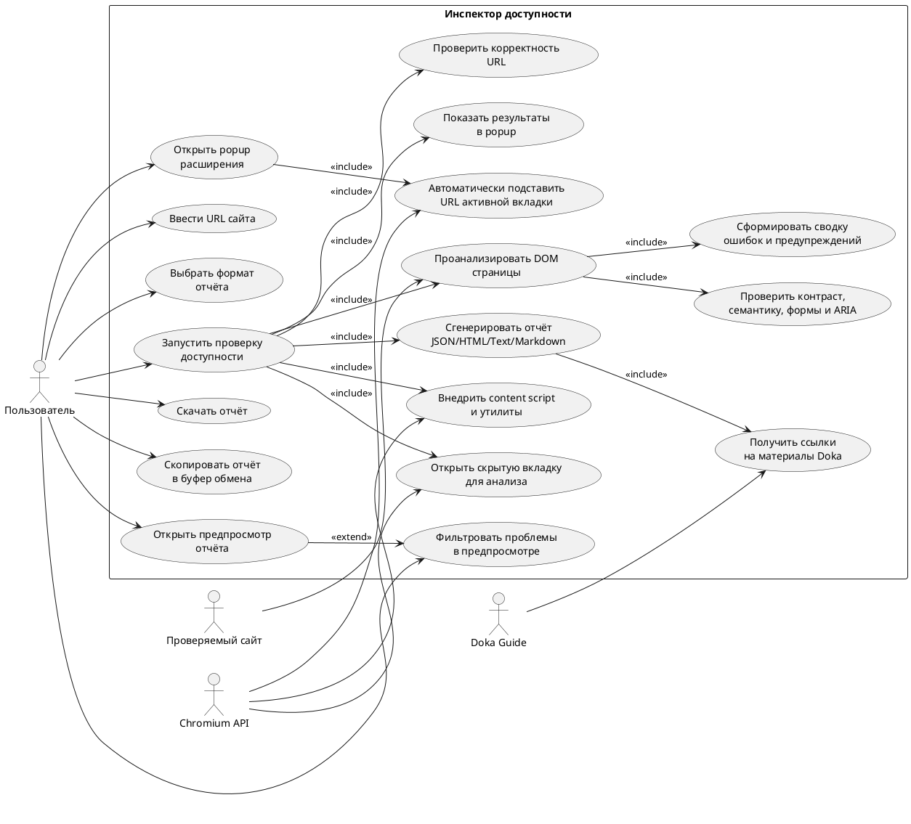
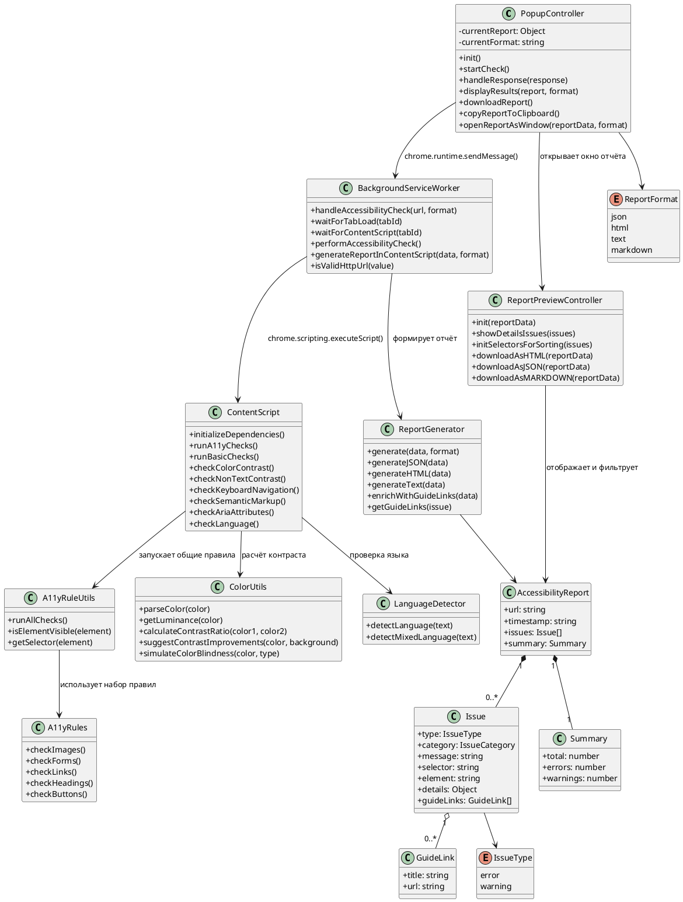
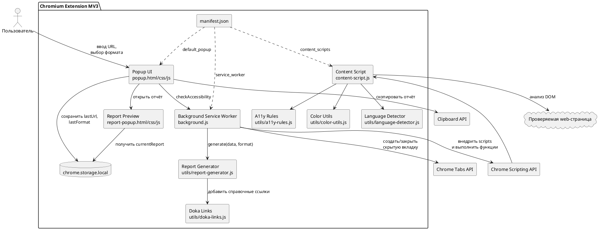
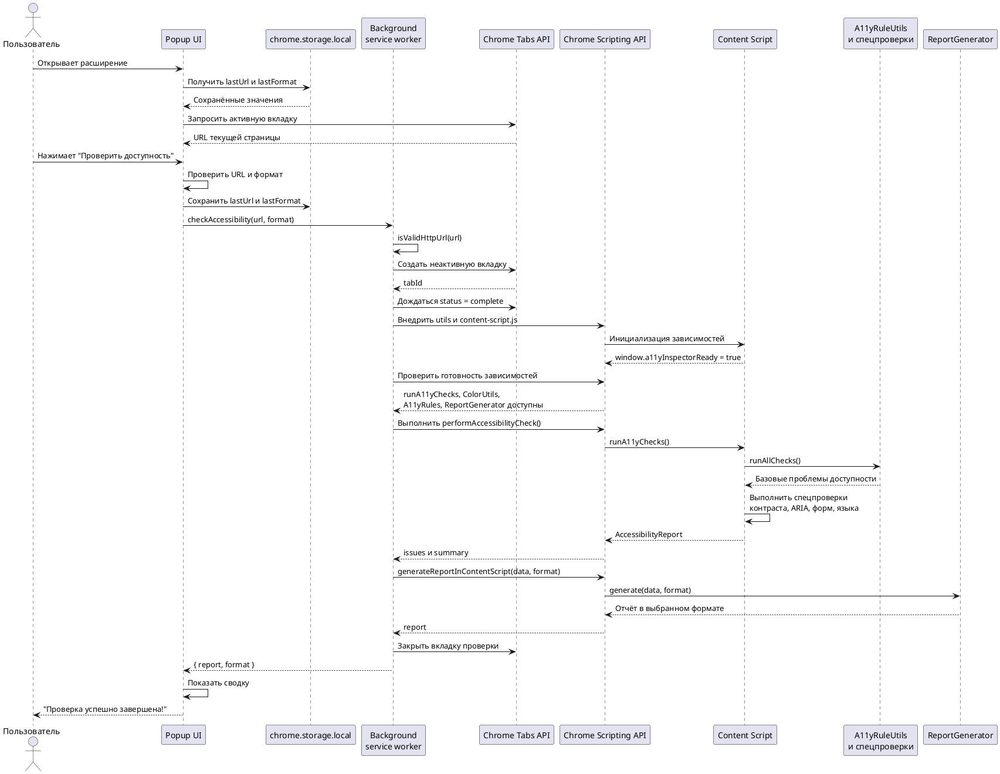
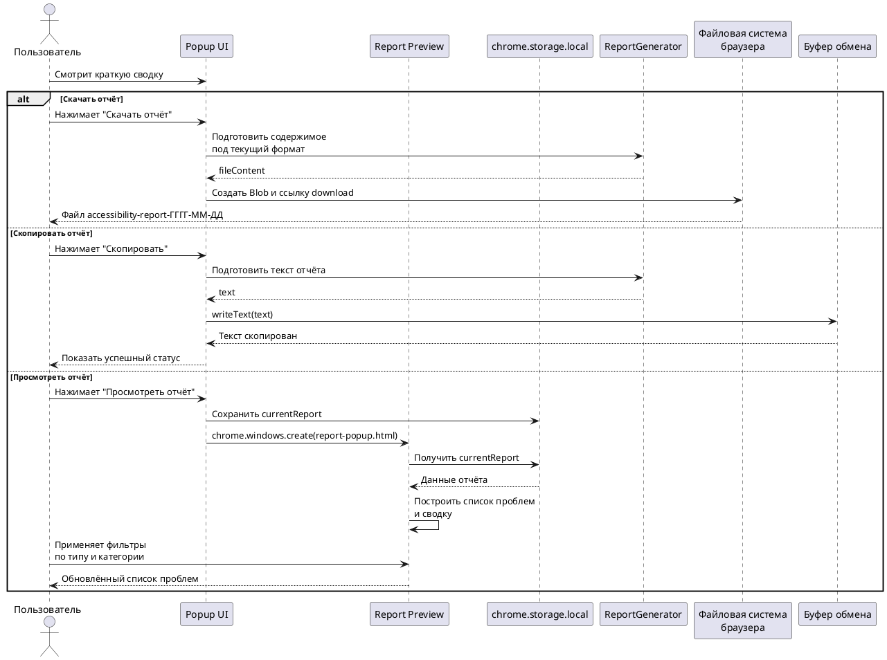
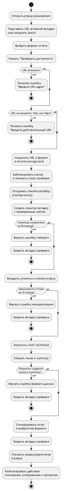
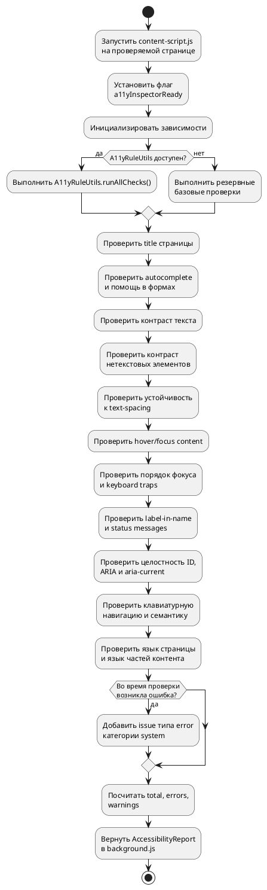

# UML-диаграммы для A11y Inspector

Ниже - набор UML-диаграмм в формате PlantUML для проекта "Инспектор доступности".
Проект представляет собой Chromium-расширение Manifest V3, которое запускает проверку доступности страницы, анализирует DOM в изолированной вкладке и формирует отчёт в выбранном формате.

---

## 1. Диаграмма вариантов использования

---

## 2. Диаграмма классов и модулей

---

## 3. Диаграмма компонентов

---

## 4. Диаграмма последовательности: проверка доступности сайта

---

## 5. Диаграмма последовательности: просмотр и сохранение отчёта

---

## 6. Диаграмма активности: запуск проверки

---

## 7. Диаграмма активности: анализ DOM и формирование проблем

